# Adapter-API

Sistema de integração unificada para redes sociais implementando o **Padrão Adapter** com **Factory Pattern** e **Sistema de Resposta Unificado**.

## 🚀 Funcionalidades Implementadas

### ✅ Tarefa 1: Padrão Adapter Básico
- Interface unificada `RedeSocialInterface` para todas as redes sociais
- Adapters específicos para Instagram, Twitter e LinkedIn
- Conversão automática entre formatos unificados e específicos de cada API

### ✅ Tarefa 2: Sistema de Resposta Unificado
- Classe `RespostaUnificada<T>` para padronizar todas as respostas
- Tratamento de erros consistente com códigos específicos
- Métodos estáticos para facilitar criação de respostas de sucesso/erro
- Timestamp automático em todas as respostas

### ✅ Tarefa 3: Social Media Factory com Configuração Dinâmica
- Factory `SocialMediaFactory` para criação dinâmica de adapters
- Carregamento de configurações via arquivo `config.properties`
- Cache de adapters para melhor performance
- Configuração personalizada por rede social
- Enum `TipoRedeSocial` para type safety

## 📁 Estrutura do Projeto

```
├── Main.java                    # Classe principal com testes
├── RedeSocialInterface.java     # Interface unificada
├── RespostaUnificada.java       # Sistema de resposta padronizado
├── SocialMediaFactory.java      # Factory para criação dinâmica
├── config.properties            # Arquivo de configuração
├── InstagramAdapter.java        # Adapter para Instagram
├── TwitterAdapter.java          # Adapter para Twitter
├── LinkedinAdapter.java         # Adapter para LinkedIn
├── InstagramAPI.java            # API simulada do Instagram
├── TwitterAPI.java              # API simulada do Twitter
├── LinkedinAPI.java             # API simulada do LinkedIn
├── Conteudo.java                # Modelo de conteúdo
├── PublicacaoResponse.java      # Resposta de publicação
├── AgendamentoResponse.java     # Resposta de agendamento
├── Estatisticas.java            # Modelo de estatísticas
└── TipoConteudo.java            # Enum de tipos de conteúdo
```

## 📊 Diagrama de Classes

```mermaid
classDiagram
    %% Interface Principal
    class RedeSocialInterface {
        <<interface>>
        +publicar(Conteudo) RespostaUnificada~PublicacaoResponse~
        +obterEstatisticas(String) RespostaUnificada~Estatisticas~
        +agendarPublicacao(Conteudo, long) RespostaUnificada~AgendamentoResponse~
        +deletarPublicacao(String) RespostaUnificada~Boolean~
    }

    %% Sistema de Resposta Unificado
    class RespostaUnificada~T~ {
        -boolean sucesso
        -String mensagem
        -T dados
        -String codigoErro
        -long timestamp
        +RespostaUnificada(T)
        +RespostaUnificada(String, String)
        +sucesso(T) RespostaUnificada~T~
        +erro(String, String) RespostaUnificada~T~
        +isSucesso() boolean
        +getMensagem() String
        +getDados() T
        +getCodigoErro() String
        +getTimestamp() long
    }

    %% Factory Pattern
    class SocialMediaFactory {
        -Map~String, RedeSocialInterface~ adapters
        -Properties config
        +carregarConfiguracao(String) void
        +criarAdapter(TipoRedeSocial) RedeSocialInterface
        +criarAdapter(TipoRedeSocial, ConfiguracaoRedeSocial) RedeSocialInterface
        +criarTodosAdapters() Map~TipoRedeSocial, RedeSocialInterface~
        +removerAdapter(TipoRedeSocial) void
        +limparCache() void
        +listarAdaptersAtivos() void
        +isRedeSocialAtiva(TipoRedeSocial) boolean
        +obterConfiguracao(TipoRedeSocial) ConfiguracaoRedeSocial
    }

    class TipoRedeSocial {
        <<enumeration>>
        INSTAGRAM
        TWITTER
        LINKEDIN
        +getNome() String
    }

    class ConfiguracaoRedeSocial {
        -String appId
        -String appSecret
        -boolean ativo
        +ConfiguracaoRedeSocial(String, String, boolean)
        +getAppId() String
        +getAppSecret() String
        +isAtivo() boolean
    }

    %% Adapters
    class InstagramAdapter {
        -InstagramAPI api
        +InstagramAdapter(String, String)
        +publicar(Conteudo) RespostaUnificada~PublicacaoResponse~
        +obterEstatisticas(String) RespostaUnificada~Estatisticas~
        +agendarPublicacao(Conteudo, long) RespostaUnificada~AgendamentoResponse~
        +deletarPublicacao(String) RespostaUnificada~Boolean~
    }

    class TwitterAdapter {
        -TwitterAPI api
        +TwitterAdapter(String, String)
        +publicar(Conteudo) RespostaUnificada~PublicacaoResponse~
        +obterEstatisticas(String) RespostaUnificada~Estatisticas~
        +agendarPublicacao(Conteudo, long) RespostaUnificada~AgendamentoResponse~
        +deletarPublicacao(String) RespostaUnificada~Boolean~
    }

    class LinkedinAdapter {
        -LinkedinAPI api
        +LinkedinAdapter(String, String)
        +publicar(Conteudo) RespostaUnificada~PublicacaoResponse~
        +obterEstatisticas(String) RespostaUnificada~Estatisticas~
        +agendarPublicacao(Conteudo, long) RespostaUnificada~AgendamentoResponse~
        +deletarPublicacao(String) RespostaUnificada~Boolean~
    }

    %% APIs Simuladas
    class InstagramAPI {
        +InstagramAPI(String, String)
        +createPost(String, String, String[]) InstagramResponse
        +createStory(String, int) InstagramResponse
        +getInsights(String) InstagramInsights
    }

    class TwitterAPI {
        +TwitterAPI(String, String)
        +tweet(String, String, String[]) TwitterResponse
        +createThread(String[]) TwitterResponse
        +getAnalytics(String) TwitterAnalytics
    }

    class LinkedinAPI {
        +LinkedinAPI(String, String)
        +share(String, String, String[]) LinkedinResponse
        +createArticle(String, String, String) LinkedinResponse
        +getStatistics(String) LinkedinStatistics
    }

    %% Modelos de Dados
    class Conteudo {
        +String texto
        +String imagemUrl
        +String[] hashtags
        +TipoConteudo tipo
        +String[] mensagens
    }

    class TipoConteudo {
        <<enumeration>>
        POST
        STORY
        THREAD
        ARTICLE
    }

    class PublicacaoResponse {
        +String id
        +String url
        +String status
        +long dataPublicacao
    }

    class AgendamentoResponse {
        +String agendamentoId
        +long dataAgenda
        +boolean sucesso
    }

    class Estatisticas {
        +int curtidas
        +int comentarios
        +int compartilhamentos
        +int visualizacoes
    }

    %% Classe Principal
    class Main {
        +main(String[]) void
        -testarRedeSocialComRespostaUnificada(RedeSocialInterface, Conteudo, String) void
        -testarCriacaoDinamica() void
    }

    %% Relacionamentos
    RedeSocialInterface <|.. InstagramAdapter : implements
    RedeSocialInterface <|.. TwitterAdapter : implements
    RedeSocialInterface <|.. LinkedinAdapter : implements

    SocialMediaFactory --> TipoRedeSocial : uses
    SocialMediaFactory --> ConfiguracaoRedeSocial : creates
    SocialMediaFactory --> RedeSocialInterface : creates

    InstagramAdapter --> InstagramAPI : uses
    TwitterAdapter --> TwitterAPI : uses
    LinkedinAdapter --> LinkedinAPI : uses

    RedeSocialInterface --> RespostaUnificada : returns
    RedeSocialInterface --> Conteudo : receives
    RedeSocialInterface --> PublicacaoResponse : returns
    RedeSocialInterface --> Estatisticas : returns
    RedeSocialInterface --> AgendamentoResponse : returns

    Conteudo --> TipoConteudo : uses

    Main --> SocialMediaFactory : uses
    Main --> RedeSocialInterface : uses
    Main --> Conteudo : creates
```



## 🔧 Como Usar

### 1. Configuração
Edite o arquivo `config.properties`:
```properties
instagram.appId=seu_app_id
instagram.appSecret=seu_app_secret
instagram.ativo=true

twitter.appId=sua_api_key
twitter.appSecret=seu_api_secret
twitter.ativo=true

linkedin.appId=seu_client_id
linkedin.appSecret=seu_client_secret
linkedin.ativo=true
```

### 2. Uso Básico
```java
// Carrega configurações
SocialMediaFactory.carregarConfiguracao("config.properties");

// Cria todos os adapters ativos
Map<TipoRedeSocial, RedeSocialInterface> adapters = 
    SocialMediaFactory.criarTodosAdapters();

// Usa um adapter específico
RedeSocialInterface instagram = adapters.get(TipoRedeSocial.INSTAGRAM);
```

### 3. Uso Avançado
```java
// Criação com configuração personalizada
ConfiguracaoRedeSocial config = new ConfiguracaoRedeSocial(
    "custom_id", "custom_secret", true);
RedeSocialInterface twitter = SocialMediaFactory.criarAdapter(
    TipoRedeSocial.TWITTER, config);

// Verificação de status
boolean ativo = SocialMediaFactory.isRedeSocialAtiva(TipoRedeSocial.INSTAGRAM);

// Obtenção de configuração
ConfiguracaoRedeSocial configLinkedin = 
    SocialMediaFactory.obterConfiguracao(TipoRedeSocial.LINKEDIN);
```